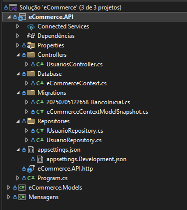

# Projeto eCommerce - Estudos sobre API com ASP.NET Core e Entity Framework Core

Este projeto é um repositório de estudos focado na criação de APIs utilizando ASP.NET Core e Entity Framework Core. O objetivo principal é aprofundar o conhecimento no desenvolvimento de APIs robustas e escaláveis, explorando as melhores práticas e recursos oferecidos por essas tecnologias.



## Tecnologias Utilizadas

* **C#**: Linguagem de programação principal.
* **ASP.NET Core**: Framework para construção da API web.
* **Entity Framework Core**: ORM (Object-Relational Mapper) para interação com o banco de dados.
* **SQL Server**: Banco de dados utilizado para persistência dos dados.

## Estrutura do Projeto

A estrutura do projeto está organizada da seguinte forma:

* **`eCommerce.API`**: Contém a lógica da API, controladores, configurações de banco de dados e repositórios.
    * **`Controllers`**: Define os endpoints da API (ex: `UsuariosController.cs`).
    * **`Database`**: Contém o contexto do Entity Framework Core (`eCommerceContext.cs`) e as migrações.
        * **`Migrations`**: Gerenciamento de schema do banco de dados (ex: `20250705122658_BancoInicial.cs`).
    * **`Repositories`**: Camada de acesso a dados, com interfaces e implementações (ex: `IUsuarioRepository.cs`, `UsuarioRepository.cs`).
    * **`Properties`**: Contém as configurações do projeto.
    * **`appsettings.json`**: Arquivos de configuração da aplicação.
    * **`Program.cs`**: Ponto de entrada da aplicação.
* **`eCommerce.Models`**: Contém os modelos de domínio e entidades do projeto (ex: `Mensagens`).

## Como Rodar o Projeto

1.  **Pré-requisitos**:
    * .NET SDK (versão compatível com o projeto, geralmente a mais recente LTS).
    * SQL Server (instância local ou remota).
    * Visual Studio ou Visual Studio Code (com as extensões C# e ASP.NET Core).

2.  **Clone o repositório**:
    ```bash
    git clone [https://github.com/xX-Mill3r-Xx/eCommerce.git](https://github.com/xX-Mill3r-Xx/eCommerce.git)
    cd eCommerce
    ```

3.  **Configurar o Banco de Dados**:
    * Abra o arquivo `appsettings.json` (ou `appsettings.Development.json`) dentro do projeto `eCommerce.API`.
    * Atualize a string de conexão do SQL Server para apontar para sua instância de banco de dados. Exemplo:
        ```json
        "ConnectionStrings": {
            "DefaultConnection": "Server=SEU_SERVIDOR;Database=eCommerceDB;User ID=SEU_USUARIO;Password=SUA_SENHA;TrustServerCertificate=True"
        }
        ```
        *Substitua `SEU_SERVIDOR`, `SEU_USUARIO` e `SUA_SENHA` pelos seus dados.*

4.  **Aplicar Migrações do Banco de Dados**:
    * No terminal, navegue até a pasta `eCommerce.API`.
    * Execute os seguintes comandos para aplicar as migrações e criar o banco de dados (se ainda não existir):
        ```bash
        dotnet ef database update
        ```

5.  **Rodar a Aplicação**:
    * No terminal, na pasta `eCommerce.API`, execute:
        ```bash
        dotnet run
        ```
    * A API será iniciada e estará acessível em `https://localhost:XXXX` (a porta pode variar, verifique a saída do comando `dotnet run`).

## Endpoints da API (Exemplos)

* **Usuários**:
    * `GET /api/usuarios`: Retorna todos os usuários.
    * `GET /api/usuarios/{id}`: Retorna um usuário específico pelo ID.
    * `POST /api/usuarios`: Cria um novo usuário.
    * `PUT /api/usuarios/{id}`: Atualiza um usuário existente.
    * `DELETE /api/usuarios/{id}`: Exclui um usuário.

* *Adicione aqui outros endpoints conforme você os implementa.*

## Contribuições

Este projeto é para fins de estudo, mas sinta-se à vontade para abrir issues ou sugerir melhorias se tiver alguma ideia.

## Licença

Este projeto está sob a licença MIT. Veja o arquivo [LICENSE](LICENSE) para mais detalhes.

---

**Desenvolvido por:** xX-Mill3r-Xx
